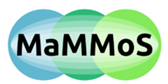

# MagneticMaterialsOntology

Ontology for magnetic materials
===============================
An EMMO-based ontology for magnetic materials.

Status
------

- [X] Proposal
- [ ] Accepted, under development
- [ ] Official

This ontology is work-in-progress (WIP).

* Application submitted: December 2024
* Application accepted on: TBD

Imported ontologies
-------------------

This ontology builds on top of [EMMO](https://github.com/emmo-repo/EMMO) [^1]. See the following table for version
compatibilities:

| Imported Ontologies  | Version             |      |
| -------------------- | --------------------| --------- |
| [EMMO](https://github.com/emmo-repo/EMMO)  | 1.0.2 inferred | https://emmo-repo.github.io/versions/1.0.2/emmo-inferred.ttl |

Using
-----

You may view the ontology by browsing through the [html documentation](https://mammos-project.github.io/MagneticMaterialsOntology/doc/magnetic_material_mammos.html).

Alternatively you can use [Protégé](https://protege.stanford.edu/):
* Install Protégé
* Download the file `magnetic_material_mammos.ttl`  
  Click on the file  
  Select the icon for `Downloading raw file` 
* Start Protégé and open the magnetic materials ontology
  File --> Open magnetic_material_mammos.ttl 
* Run the Reasoner  
  Reasoner --> select HermiT  
  Reasoner --> Start reasoner 
* Navigate  
  Open the Classes Tab (Window --> Tab: select Classes)  
  Select Inferred at the top right pull down menu of the Classes Tab  
  Use Ctrl-F (Edit --> Find) to search for a term for example type "Magnet"
* Visualize the knowledge tree  
  Open the OntoGraf Tab (Window --> Tab: select OntoGraf)  
  Select an entity in the Classes Tab to visualize
* Reset view (if something goes wrong)  
  Window --> Reset selected tab to default state
  
Building
--------

MagneticMaterialsOntology is built using tools provided by EMMO. For more details see the [src directory](https://github.com/MaMMoS-project/MagneticMaterialsOntology/tree/main/src).

Installation of required software is also explained in  [src/README.md](https://github.com/MaMMoS-project/MagneticMaterialsOntology/tree/main/src/README.md).

Build Status
------------

Attributions and credits
------------------------

### Authors
- Thomas Schrefl, DISS-UWK
- Wilfried Hortschitz, DISS-UWK

### Projects
- Created within the EU project [MaMMoS](https://mammos-project.github.io/) [^2]. Grant number 101135546 (HORIZON-CL4-2023-DIGITAL-EMERGING-01).

### Acknowledgement

Funded by the European Union. Views and opinions expressed are however those of the author(s) only and do not necessarily reflect those of the European Union or European Health and Digital Executive Agency (HADEA). Neither the European Union nor the granting authority can be held responsible for them.

License
-------

This project is licensed under the [Creative Commons Attribution 4.0 International License](http://creativecommons.org/licenses/by/4.0/).

References
----------

[^1]: https://github.com/emmo-repo/EMMO  
[^2]: https://mammos-project.github.io/
