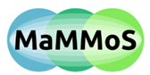

# Magnetic Materials Ontology (MagMO)

The development of the magnetic materials ontology was moved to the repository https://github.com/emmo-repo/domain-magnetic-materials.

Attributions and credits
------------------------

### Authors
- Thomas Schrefl, DISS-UWK
- Wilfried Hortschitz, DISS-UWK

### Projects
- Created within the EU project [MaMMoS](https://mammos-project.github.io/) [^2]. Grant number 101135546 (HORIZON-CL4-2023-DIGITAL-EMERGING-01).

### Acknowledgement

Funded by the European Union. Views and opinions expressed are however those of the author(s) only and do not necessarily reflect those of the European Union or European Health and Digital Executive Agency (HADEA). Neither the European Union nor the granting authority can be held responsible for them.

License
-------

This project is licensed under the [Creative Commons Attribution 4.0 International License](http://creativecommons.org/licenses/by/4.0/).

References
----------

[^1]: https://github.com/emmo-repo/EMMO  
[^2]: https://mammos-project.github.io/
